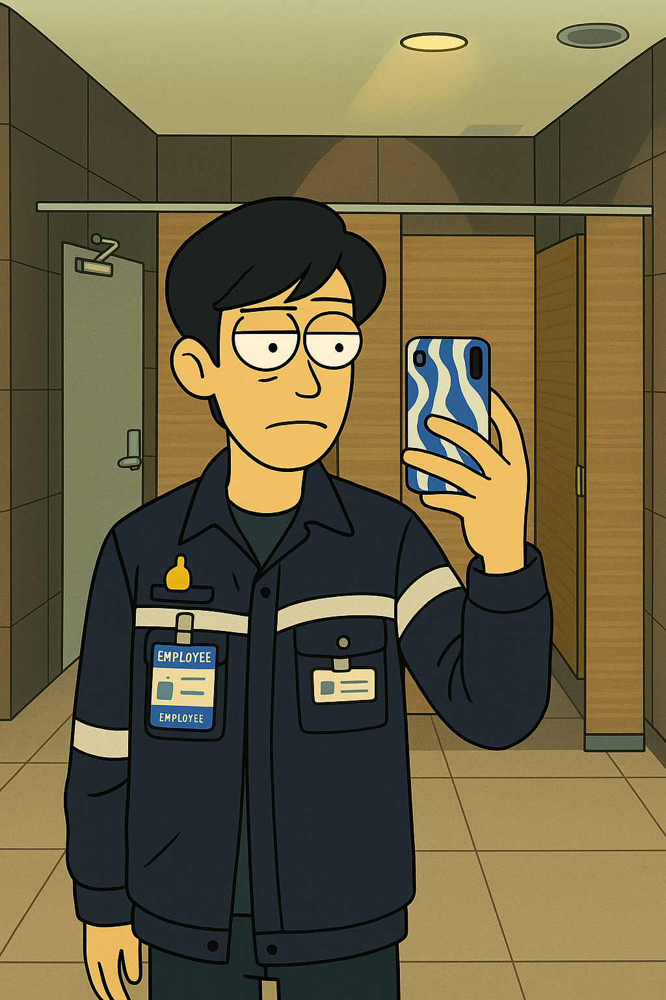
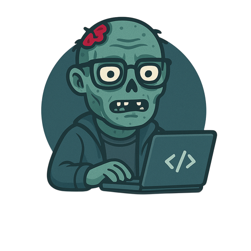

# 🌌 **JONUS NATTAPONG | ZOMBITX64** 🌠

### ✨ **FULL STACK DEVELOPER | AI VISIONARY | SOFTWARE ARCHITECT | AUTOMATION EXPERT** ✨

---

### **🌟 Connect with Me 🌟**

 

 

---

## 
👤 **ABOUT ME** 👤

> _"Building the future, one line of code at a time."_ – **ZombitX64**

I'm a passionate innovator **combining code, AI, and creativity** to build impactful solutions. With a background in computer engineering, I strive to turn complex challenges into elegant digital realities.

- 🔭 **Currently Working On:** Scalable AI Systems & Efficient Data Pipelines
- 🌱 **Continuously Learning:** Advanced Cloud Architectures & MLOps Practices
- 💬 **Ask Me About:** Python Development, API Design, AI Implementation
- 😄 **Fun Fact:** I enjoy turning complex data into insightful visualizations.
- 💡 **Collaboration:** Open to collaborating on innovative open-source projects.

---

## 
🛠️ **MY TECH STACK** 🛠️

<table align="center" style="border: none; background-color: transparent;">
  <tr>
    <td style="border: none; padding: 10px;">
      <h3 align="center"> Lᴀɴɢᴜᴀɢᴇs & Fʀᴀᴍᴇᴡᴏʀᴋs </h3>
      

        
        
        
        
        
        
      

    </td>
    <td style="border: none; padding: 10px;">
      <h3 align="center"> AI & Dᴀᴛᴀ Sᴄɪᴇɴᴄᴇ </h3>
      

        
        
        
        
        
        
      

    </td>
  </tr>
  <tr>
    <td style="border: none; padding: 10px;">
      <h3 align="center"> DᴇᴠOᴘs & Tᴏᴏʟs </h3>
      

        
        
        
        
        
      

    </td>
    <td style="border: none; padding: 10px;">
      <h3 align="center"> Dᴀᴛᴀʙᴀsᴇs </h3>
      

        
        
        
        
        
      

    </td>
  </tr>
</table>

---

## 
📈 **MY GITHUB STATS** 📈

### **🌟 Key Highlights**

<table align="center" style="border: none; background-color: transparent;">
  <tr>
    <td style="border: none; padding: 10px;">
      
    </td>
    <td style="border: none; padding: 10px;">
      
    </td>
  </tr>
</table>

---

### **🔥 Consistency Matters**

---

### **📊 Activity Overview**

---

### **🏆 Achievements**

---

## 
🚀 **FEATURED PROJECTS** 🚀

  

  

---

### 🙏 **SUPPORT MY WORK**

