<!-- Profile README (UTF-8). Terminal / cyberpunk vibe, clean + practical. -->

<div align="center">
  
  <h1>Jonus Nattapong</h1>
  <p><code>ZombitX64</code> • Software Engineer • AI/ML • Data &amp; Automation</p>

  <p>
    <a href="https://github.com/JonusNattapong">
      
    </a>
    <a href="https://huggingface.co/ZombitX64">
      
    </a>
    <a href="https://leetcode.com/u/JonusNattapong/">
      
    </a>
  </p>

  
</div>

```txt
┌─[ jonus@github ]─[ ~/profile ]
└──╼ $ ./about --short
name        : Jonus Nattapong (aka ZombitX64)
focus       : LLM agents • dataset engineering • data pipelines • automation
also        : trading systems (MQL5) • time-series • backend APIs
```

---

## /about
ผมทำงานสายซอฟต์แวร์และ AI/ML เน้นสร้างเครื่องมือโอเพ่นซอร์ส, ชุดข้อมูล (datasets), และระบบอัตโนมัติที่ “เอาไปใช้จริงได้” ตั้งแต่งาน data extraction/ETL ไปจนถึง agent workflows และ LLM apps

- ชื่อ: Nattapong Tapachoom
- สนใจหลัก: **LLMs / Dataset Engineering / Python / LangChain / Trading EAs (MQL5)**
- โฟกัสงาน: **AI Agents, Prompt Engineering, Data Pipelines**

---

## /stack
<div align="center">
  
  
  
  
  
  
  
  
</div>

---

## /dashboard (example)
<details>
<summary><b>Show GitHub metrics panel</b></summary>
<br />
<div align="center">
  
</div>

To regenerate: GitHub → <b>Actions</b> → <b>Metrics</b> → <b>Run workflow</b>
</details>

---

## /featured
<div align="center">
  <table>
    <tr>
      <td align="center" valign="top" width="50%">
        <a href="https://github.com/JonusNattapong/OpenSpeed">
          
        </a>
        <br />
        <sub><b>OpenSpeed</b> — speed-first web framework experiments</sub>
        <br />
        <sub><code>framework</code> <code>dx</code> <code>performance</code></sub>
      </td>
      <td align="center" valign="top" width="50%">
        <a href="https://github.com/JonusNattapong/File-Search-API">
          
        </a>
        <br />
        <sub><b>File-Search-API</b> — chat with your documents (RAG + FastAPI)</sub>
        <br />
        <sub><code>agents</code> <code>rag</code> <code>fastapi</code></sub>
      </td>
    </tr>
    <tr>
      <td align="center" valign="top" width="50%">
        <a href="https://github.com/JonusNattapong/Scrape-Thai-Web">
          
        </a>
        <br />
        <sub><b>Scrape-Thai-Web</b> — Thai web scraping utilities & experiments</sub>
        <br />
        <sub><code>scraping</code> <code>thai</code> <code>etl</code></sub>
      </td>
      <td align="center" valign="top" width="50%">
        <a href="https://github.com/JonusNattapong/IDAS-NGSI-Agent-Framework">
          
        </a>
        <br />
        <sub><b>IDAS-NGSI-Agent-Framework</b> — agent framework (NGSI context)</sub>
        <br />
        <sub><code>agents</code> <code>ngsi</code> <code>integration</code></sub>
      </td>
    </tr>
    <tr>
      <td align="center" valign="top" width="50%">
        <a href="https://github.com/JonusNattapong/tsoamr.pttplc">
          
        </a>
        <br />
        <sub><b>tsoamr.pttplc</b> — AMR system for Modbus/EVC devices</sub>
        <br />
        <sub><code>industrial</code> <code>modbus</code> <code>reporting</code></sub>
      </td>
      <td align="center" valign="top" width="50%">
        <a href="https://github.com/JonusNattapong/BI-RADS-Classification">
          
        </a>
        <br />
        <sub><b>BI-RADS-Classification</b> — breast ultrasound classification dataset/task</sub>
        <br />
        <sub><code>ml</code> <code>medical</code> <code>classification</code></sub>
      </td>
    </tr>
  </table>
</div>

---

## /project-map
| Domain | What I build | Examples |
| --- | --- | --- |
| Agents / LLM Apps | agent workflows, retrieval, prompt systems | `File-Search-API`, `LangChainOllama` |
| Data / ETL | scraping, corpora, quality checks, time-series | `Scrape-Thai-Web`, `DATASET-XAUUSD-BTCUSD-2005-2025` |
| Trading Automation | research + automation around strategies | `Ai-Trading-RL`, `Trading-Ai-Lstm`, `Trading-Ai-GRU` |
| Backend / Tools | CLIs, automation, utilities | `MyDB-Management-Tool`, `DeepSeek-OCR-Prompt` |
| Framework Experiments | speed & DX experiments | `OpenSpeed` |
| Industry / IoT | polling/reporting systems | `tsoamr.pttplc`, `TSO-AMR-PTT-PLC` |

---

## /latest
<details>
<summary><b>Show latest repositories</b></summary>

| Repository | Description | Updated |
| --- | --- | --- |
| [Botnet](https://github.com/JonusNattapong/Botnet) | security research (authorized labs only) | 2025-12-19 |
| [Ransomware](https://github.com/JonusNattapong/Ransomware) | security research (authorized labs only) | 2025-12-18 |
| [Scrape-Thai-Web](https://github.com/JonusNattapong/Scrape-Thai-Web) | — | 2025-12-18 |
| [IDAS-NGSI-Agent-Framework](https://github.com/JonusNattapong/IDAS-NGSI-Agent-Framework) | — | 2025-12-18 |
| [dopa-ready-01](https://github.com/JonusNattapong/dopa-ready-01) | — | 2025-12-17 |
| [tsoamr.pttplc](https://github.com/JonusNattapong/tsoamr.pttplc) | AMR (Automatic Meter Reading) System for Modbus/EVC Devices Data Polling, Reporting, and Management with Web Interface | 2025-12-17 |
| [TSO-AMR-PTT-PLC](https://github.com/JonusNattapong/TSO-AMR-PTT-PLC) | — | 2025-12-16 |
| [Ransomware-attack](https://github.com/JonusNattapong/Ransomware-attack) | security research (authorized labs only) | 2025-12-13 |
| [DeepSeek-OCR-Prompt](https://github.com/JonusNattapong/DeepSeek-OCR-Prompt) | — | 2025-12-10 |
| [OpenSpeed](https://github.com/JonusNattapong/OpenSpeed) | A high-performance, developer-friendly web framework inspired by Hono and Elysia. Built for speed, extensibility, and excellent DX across multiple JavaScript runtimes. | 2025-12-09 |
| [EA-P90](https://github.com/JonusNattapong/EA-P90) | — | 2025-12-08 |
| [RL-Winrate](https://github.com/JonusNattapong/RL-Winrate) | — | 2025-12-07 |
| [Trading-Ai-Lstm](https://github.com/JonusNattapong/Trading-Ai-Lstm) | — | 2025-12-03 |
| [Trading-Ai-GRU](https://github.com/JonusNattapong/Trading-Ai-GRU) | — | 2025-12-03 |
| [DATASET-XAUUSD-BTCUSD-2005-2025](https://github.com/JonusNattapong/DATASET-XAUUSD-BTCUSD-2005-2025) | — | 2025-12-03 |
| [TimescaleDB-Prompt](https://github.com/JonusNattapong/TimescaleDB-Prompt) | — | 2025-12-02 |
| [Malware701](https://github.com/JonusNattapong/Malware701) | security research (authorized labs only) | 2025-12-01 |
| [Trading-Ai-Oa708](https://github.com/JonusNattapong/Trading-Ai-Oa708) | — | 2025-11-29 |
| [TimescaleDB-47](https://github.com/JonusNattapong/TimescaleDB-47) | — | 2025-11-27 |
| [Fiware-Smart-Prompt](https://github.com/JonusNattapong/Fiware-Smart-Prompt) | — | 2025-11-26 |
| [MyDB-Management-Tool](https://github.com/JonusNattapong/MyDB-Management-Tool) | — | 2025-11-25 |
| [BI-RADS-Classification](https://github.com/JonusNattapong/BI-RADS-Classification) | Breast ultrasound data classified according to BI-RADS standards | 2025-11-20 |
| [ai-generator-prompt](https://github.com/JonusNattapong/ai-generator-prompt) | — | 2025-11-17 |
| [tsoamr.pttplc-original](https://github.com/JonusNattapong/tsoamr.pttplc-original) | — | 2025-11-17 |
| [PyTrade-Desk](https://github.com/JonusNattapong/PyTrade-Desk) | — | 2025-11-16 |
| [Ai-Trading-RL](https://github.com/JonusNattapong/Ai-Trading-RL) | — | 2025-11-10 |
| [Eden-Ai-Survival](https://github.com/JonusNattapong/Eden-Ai-Survival) | — | 2025-11-10 |
| [File-Search-API](https://github.com/JonusNattapong/File-Search-API) | Chat with your documents using OpenRouter and FastAPI | 2025-11-09 |
| [Ai-trading-angle](https://github.com/JonusNattapong/Ai-trading-angle) | — | 2025-11-08 |
| [EA-AK47Hybrid](https://github.com/JonusNattapong/EA-AK47Hybrid) | — | 2025-11-07 |

</details>

---

## /security-research (authorized only)
โปรเจกต์บางส่วนเป็นงานด้าน security research / malware simulation เพื่อการศึกษาและการทดสอบที่ได้รับอนุญาตเท่านั้น (no instructions, no misuse)

<details>
<summary><b>Show repositories (security research)</b></summary>

- [Botnet](https://github.com/JonusNattapong/Botnet) (Rust) — simulated C2 client for authorized lab testing
- [Ransomware](https://github.com/JonusNattapong/Ransomware) (Rust) — malware behavior simulation for education/research
- [Ransomware-attack](https://github.com/JonusNattapong/Ransomware-attack) — education/research only
- [Malware701](https://github.com/JonusNattapong/Malware701) — education/research only

</details>

---

## /stats
<div align="center">
  
  
</div>

---

## /connect
- GitHub: https://github.com/JonusNattapong
- Hugging Face: https://huggingface.co/ZombitX64
- LeetCode: https://leetcode.com/u/JonusNattapong/
