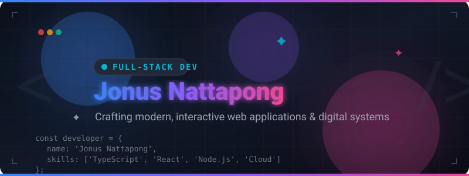
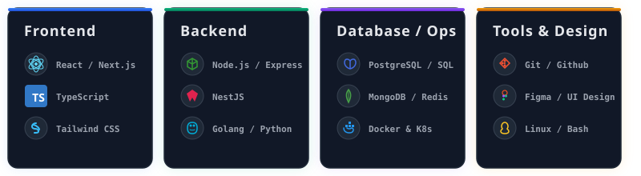
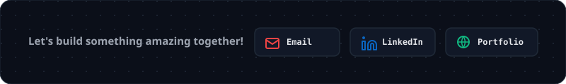

<!-- MAIN HEADER -->

  

<!-- FLUID BIO INTRO -->

  Hi! I am <strong>Nattapong Tapachoom (Jonus)</strong>, a software developer focused on building fast, modern, and scalable digital systems. 
  I enjoy exploring new technologies, writing clean code, and architecting efficient workflows.

  🚀 Currently developing web applications with <strong>React</strong>, <strong>Next.js</strong>, and <strong>Node.js (NestJS)</strong> 
  • 💡 Deeply interested in <strong>Cloud Native</strong>, <strong>DevOps</strong>, and <strong>Systems Architecture</strong> 
  • 🌱 Actively expanding my expertise in <strong>Golang</strong>, <strong>Docker</strong>, and <strong>Kubernetes</strong>.

 

<!-- COHESIVE VISUAL FLOW: TECH STACK & METRICS -->

  

  <!-- GitHub Metrics and Streak Side by Side -->
  
  

  <!-- General Stats Card -->
  

 

<!-- FOOTER CONNECT CARD -->

  

  
  
  

